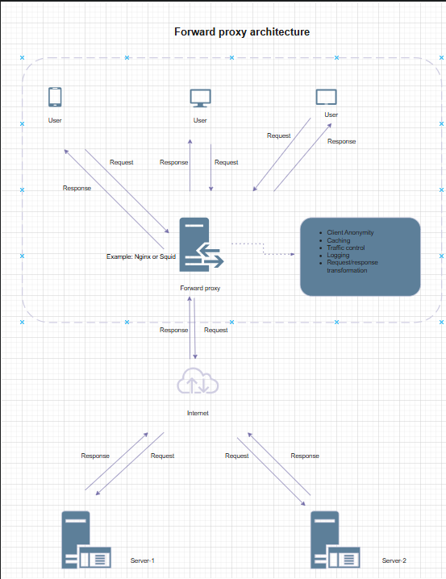
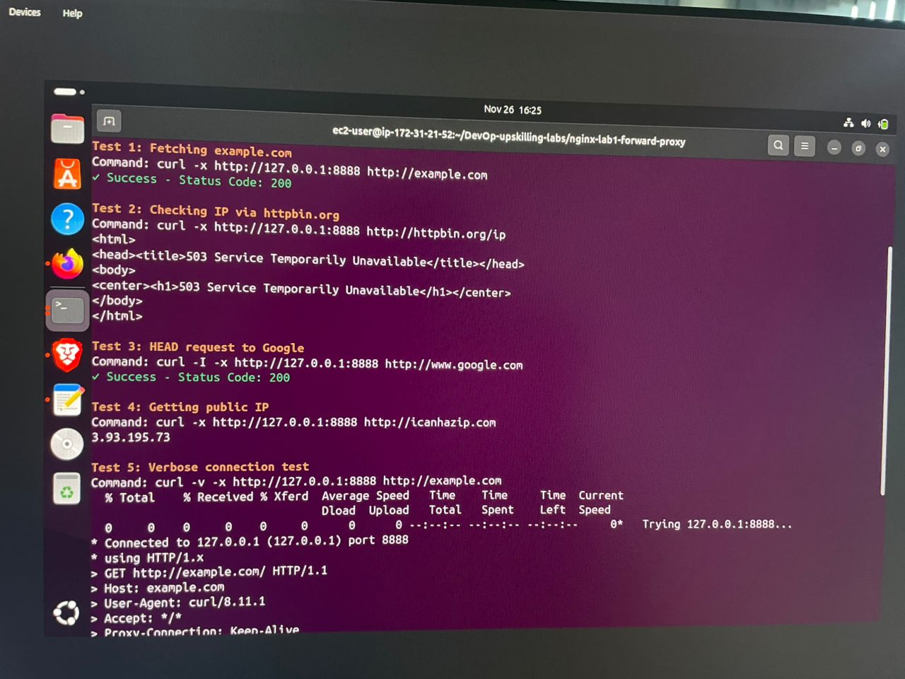

# Lab 2: Forward Proxy Setup using Nginx

## Architecture

The following diagram illustrates the forward proxy architecture implemented in this lab:

The architecture shows how client requests are routed through the Nginx forward proxy server before reaching external destinations. The proxy handles DNS resolution, access control, and request logging.

---

## EC2 Instance Specifications

### Instance Details

- **AMI**: Amazon Linux 2023
- **Instance Type**: t2.micro (free tier eligible)
- **Storage**: 8 GB EBS General Purpose SSD
- **VPC**: Default VPC with subnet 172.31.0.0/20
- **Proxy Port**: 8888
- **Protocol**: HTTP

### Network Configuration

- Public IP is auto-assigned by AWS
- Private IP assigned from VPC subnet range
- Proxy service listens on port 8888 for HTTP traffic

---

## Installation and Configuration Steps

### Step 1: Launch and Connect to EC2 Instance

Launch an EC2 instance from AWS Console with the specifications mentioned above. Once launched, connect to the instance using SSH with your key pair.

### Step 2: Install Nginx

Update the system package manager and install Nginx web server. After installation, start the Nginx service and enable it to automatically start on system boot.

### Step 3: Create Configuration Structure

Create the necessary directory structure for Nginx site configurations. This includes creating directories for available sites and enabled sites, following the standard Nginx convention.

### Step 4: Configure Forward Proxy

Create a forward proxy configuration file in the sites-available directory. The configuration includes:

- **Port Configuration**: Nginx listens on port 8888 for proxy requests
- **Access Control Lists**: Define which IP addresses can use the proxy (localhost, VPC subnet, and your specific IP)
- **DNS Resolvers**: Configure Google DNS servers (8.8.8.8 and 8.8.4.4) for domain name resolution
- **Logging**: Set up access and error logs to track all proxy traffic
- **Proxy Headers**: Configure headers to properly forward client information
- **Timeouts**: Set connection, send, and read timeouts to 60 seconds
- **HTTP Version**: Use HTTP/1.1 for better performance

### Step 5: Enable Configuration

Create a symbolic link from sites-available to sites-enabled to activate the configuration. Update the main Nginx configuration file to include all configurations from the sites-enabled directory.

### Step 6: Create Log Files

Create dedicated log files for the forward proxy with proper permissions. This ensures all proxy requests and errors are logged separately from other Nginx logs.

### Step 7: Test and Apply Configuration

Test the Nginx configuration for syntax errors before applying. Once validated, reload Nginx to apply the new forward proxy configuration. Verify that Nginx is listening on port 8888.

---

## Client Configuration Steps (How to Use the Proxy)

### Using Command Line Tools

**curl**: Add the proxy flag with your proxy server IP and port when making requests. This routes the request through your forward proxy instead of directly to the destination.

**wget**: Configure wget to use the proxy by setting environment variables or using command-line options.

**Environment Variables**: Export http_proxy and https_proxy variables with your proxy server details. This makes all command-line tools automatically use the proxy.

### Browser Configuration

**Firefox**: Navigate to network settings and select manual proxy configuration. Enter your EC2 instance public IP and port 8888. Enable the option to use this proxy for all protocols.

**Chrome**: Launch Chrome with proxy server command-line arguments, specifying your proxy IP and port.

### System-Wide Proxy

**Linux/Mac**: Edit system environment files to set proxy variables globally. This affects all applications system-wide.

**Application-Specific**: Many applications support proxy configuration in their settings or configuration files.

### Testing the Proxy

Test the proxy by making requests to public websites like example.com or httpbin.org. Verify that requests are being routed through the proxy by checking the source IP address. Monitor the proxy logs to confirm traffic is passing through.

### Verification

Check that your IP address appears as the proxy server's IP when accessing services like httpbin.org/ip. Review the access logs on the proxy server to see your requests being logged.

---

## Security Group Rules Required

### Inbound Rules

**SSH Access (Port 22)**

- Protocol: TCP
- Port: 22
- Source: Your public IP address with /32 CIDR
- Purpose: Administrative access to the EC2 instance

**Forward Proxy Access (Port 8888)**

- Protocol: TCP
- Port: 8888
- Source: Your public IP address with /32 CIDR
- Purpose: Allow proxy requests from your location

**Internal VPC Access (Port 8888)**

- Protocol: TCP
- Port: 8888
- Source: VPC CIDR block (172.31.0.0/20)
- Purpose: Allow other EC2 instances in the same VPC to use the proxy

### Outbound Rules

**HTTP Traffic (Port 80)**

- Protocol: TCP
- Port: 80
- Destination: 0.0.0.0/0 (all IPv4)
- Purpose: Allow proxy to make HTTP requests to external websites

**HTTPS Traffic (Port 443)**

- Protocol: TCP
- Port: 443
- Destination: 0.0.0.0/0 (all IPv4)
- Purpose: Allow proxy to make HTTPS requests to external websites

**DNS Queries (Port 53)**

- Protocol: UDP
- Port: 53
- Destination: 0.0.0.0/0 (all IPv4)
- Purpose: Allow DNS resolution for domain names

### Security Group Configuration Process

Navigate to the EC2 Dashboard in AWS Console and select Security Groups. Choose the security group attached to your proxy instance. Edit inbound rules and add the rules specified above for SSH and proxy access. Edit outbound rules to allow HTTP, HTTPS, and DNS traffic. Save all changes to apply the security rules immediately.

### Best Practices

- Restrict SSH access to only your IP address
- Limit proxy port access to known and trusted IP addresses
- Keep outbound rules specific to required ports only
- Regularly review and update security group rules
- Use separate security groups for different services
- Document all security group changes

---

## Testing & Verification

### Test Script Execution

The following screenshot shows the execution of the test bash script (`test-proxy.sh`) that validates the forward proxy functionality:

The test script verifies that:
- The proxy is accepting connections on port 8888
- HTTP requests are successfully routed through the proxy
- DNS resolution is working correctly
- Response codes are as expected

### Access Logs

The access logs demonstrate that requests are being properly routed through the proxy and logged:

The logs show:
- Client IP addresses making requests through the proxy
- Requested URLs and HTTP methods
- Response status codes
- Timestamps of each request
- Request processing details

These logs are essential for monitoring proxy usage, troubleshooting issues, and maintaining security.

---

## Additional Notes

The forward proxy is now configured and ready to use. All traffic passing through the proxy is logged in the access log file. Error logs help troubleshoot any issues with proxy connections. Remember to replace placeholder IP addresses with your actual EC2 public IP and your local IP address in the configuration.
